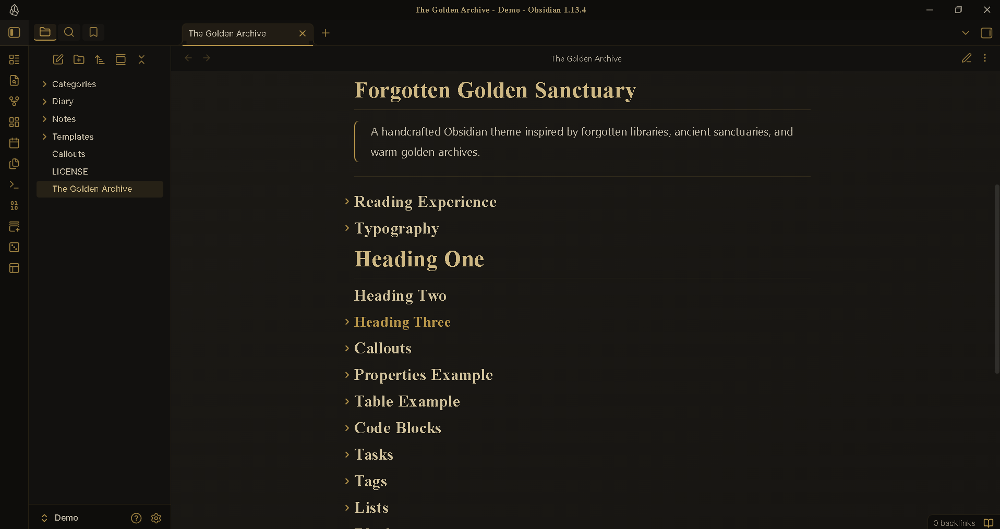
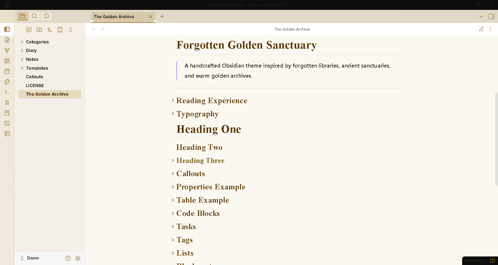
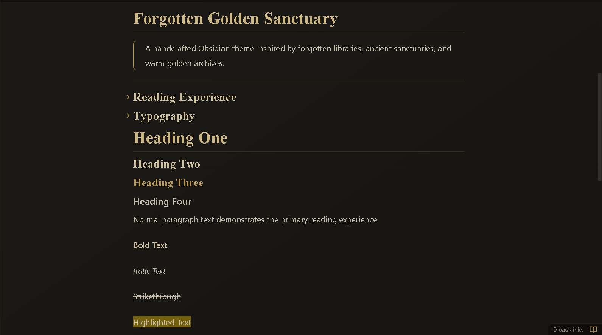
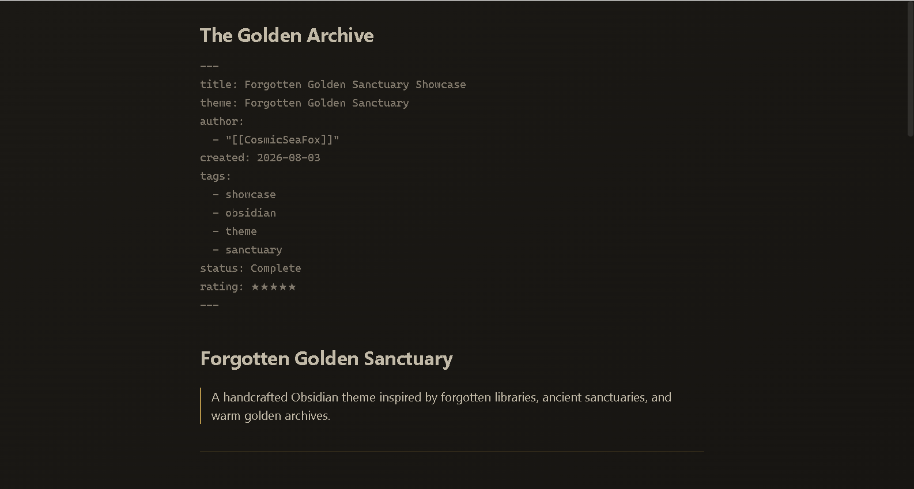
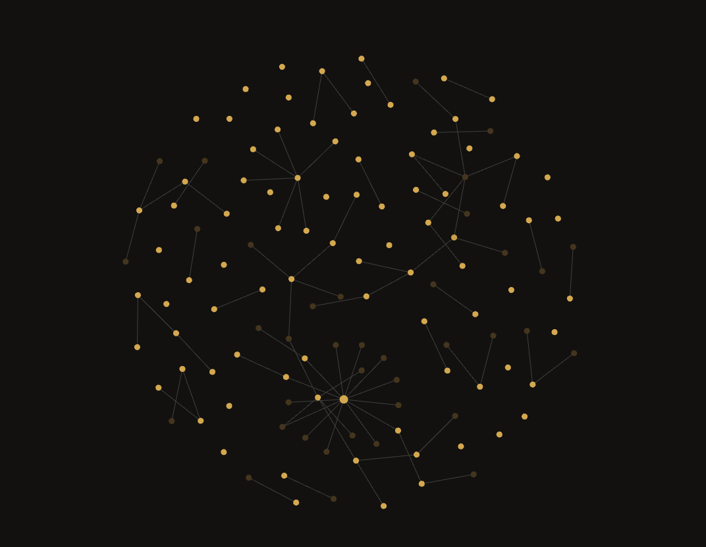
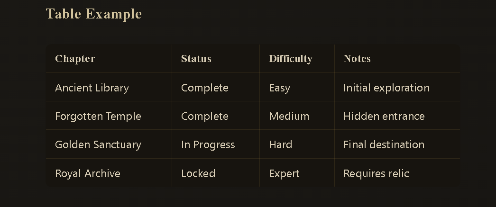
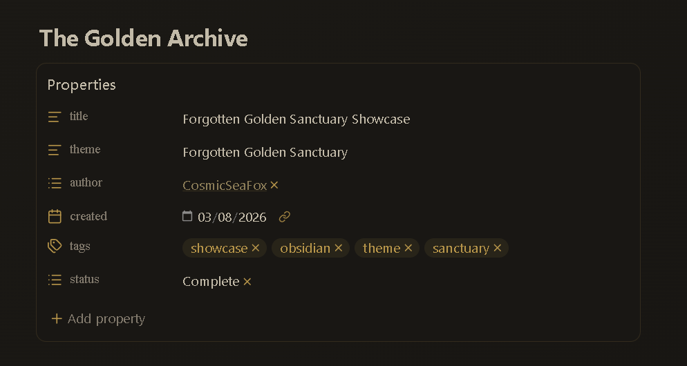
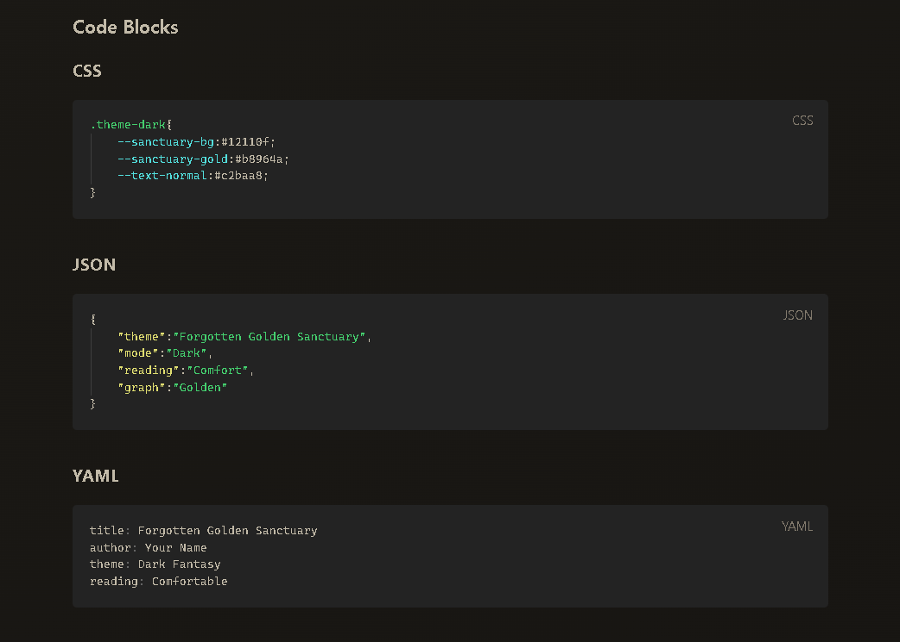

# Forgotten Golden Sanctuary


A handcrafted Obsidian theme inspired by forgotten libraries, ancient sanctuaries, and warm golden archives.

Designed for comfortable reading, focused writing, and immersive knowledge management.

---

# Preview


---

# Support ☕

If you enjoy this theme and want to support future development:

<a href="https://www.buymeacoffee.com/CosmicSeaFox" target="_blank">

</a>

[](https://ko-fi.com/cosmicseafox)
---

# Screenshots

| View | Preview |
|---|---|
| Dark Mode |  |
| Light Mode |  |
| Reading Mode |  |
| Source Mode |  |
| Graph View |  |
| Tables |  |
| Properties |  |
| Code Blocks |  |

---

# Features

| Feature | Description |
|---|---|
| 🌙 Dark Mode | Warm archive atmosphere |
| ☀️ Light Mode | Soft parchment interface |
| 📖 Reading Mode | Long-form reading focused |
| ✍️ Source Mode | Clean writing experience |
| 🏛 Typography | Cinzel + Inter fonts |
| 📑 Properties | Clear metadata styling |
| 📊 Tables | Improved readability |
| 💻 Code Blocks | Clean code presentation |
| 📝 Callouts | Custom archive styles |
| 🕸 Graph View | Golden constellation design |
| 🏷 Tags | Golden archive badges |
| ☑ Tasks | Custom checkbox styling |
| 📱 Mobile | Responsive layout |

---

# Installation

1. Download this repository.

2. Copy the theme folder:

```

Forgotten-Golden-Sanctuary

```

into:

```

YourVault/.obsidian/themes/

```

3. Open Obsidian:

```

Settings → Appearance → Themes

```

4. Select:

```

Forgotten Golden Sanctuary

```

---

# Folder Structure

```

Forgotten-Golden-Sanctuary/

├── theme.css
├── manifest.json
├── README.md
├── LICENSE
├── screenshot.png
│
└── screenshots/
├── dark.png
├── light.png
├── reading.png
├── source.png
├── graph.png
├── table.png
├── properties.png
└── code.png

```

---

# Fonts

| Purpose | Font |
|---|---|
| Body | Inter |
| Headings | Cinzel |
| Title | Cinzel Decorative |
| Code | JetBrains Mono |

---

# Compatibility

| Feature | Status |
|---|---|
| Obsidian Desktop | ✅ |
| Obsidian Mobile | ✅ |
| Reading Mode | ✅ |
| Source Mode | ✅ |
| Live Preview | ✅ |
| Graph View | ✅ |
| Properties | ✅ |
| Tables | ✅ |
| Callouts | ✅ |
| Code Blocks | ✅ |

---

# Design Philosophy

Forgotten Golden Sanctuary focuses on:

- Comfortable reading
- Reduced eye strain
- Clear typography
- Balanced contrast
- Minimal distractions
- Warm fantasy archive atmosphere

Created for:

- Writers
- Researchers
- Students
- Knowledge keepers

---

# Dark Mode

- Deep archive backgrounds
- Warm parchment text
- Antique gold accents
- Low-glare reading environment

# Light Mode

- Soft parchment surfaces
- Dark readable text
- Golden highlights
- Comfortable contrast

---

# Credits

Fonts:

- Inter
- Cinzel
- Cinzel Decorative
- JetBrains Mono

Made for the Obsidian community.

---

# License

MIT License

Made with ❤️ for writers, researchers, and knowledge keepers.

# Support ☕

If you enjoy this theme and want to support future development:

<a href="https://www.buymeacoffee.com/CosmicSeaFox" target="_blank">

</a>

